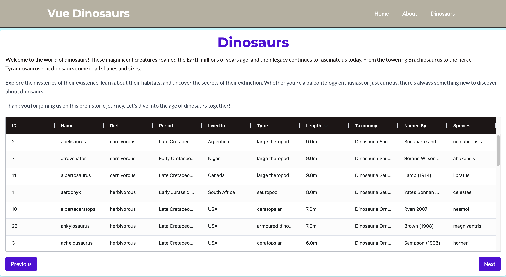

# Vue Data Structures and Algorithms

A simple dinosaur info app to show dino data in form of table using ag-grid and related libraries.


## Table of Contents
1. [Project Briefing](#project-briefing)
2. [Technologies Used](#technologies-used)
3. [Screenshots](#screenshots)
4. [Updates](#updates)
5. [Thank You](#thank-you)

## Project Briefing

This repository would have some solutions of data structures and algorithm related problems using Vue JS components.

## Technologies Used
- Vue 3
- Vite
- JavaScript (ES6+)
- HTML5
- CSS3

## Writing Test cases

Test cases are written using Vitest framework. Install the related dependencies for the testing framework and tweak vite config settings.

```Javascript
import { defineConfig } from 'vite'
import vue from '@vitejs/plugin-vue'

// https://vite.dev/config/
export default defineConfig({
  plugins: [vue()],
  test: {
    environment: 'happy-dom',
  },
  server: {
    port: 8080
  }
})
```



## Updates
- **v1.0.0**: Initial release with basic functionality.
- **v1.1.0**: Added new features and improved performance.

## Thank You
Thank you for exploring the Vue Dino App! Feel free to contribute or provide feedback to help improve the project. If you liked this project consider giving it a ⭐

Learn more about IDE Support for Vue in the [Vue Docs Scaling up Guide](https://vuejs.org/guide/scaling-up/tooling.html#ide-support).
